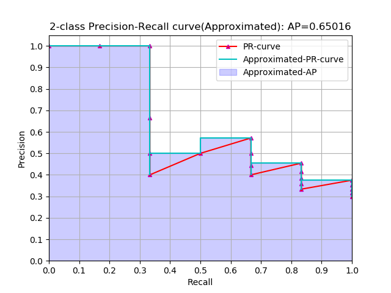
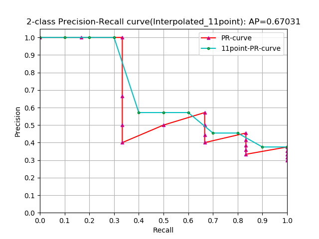

# AP
## sklearn中计算AP的方式  
[sklearn.metrics.average_precision_score](https://scikit-learn.org/stable/auto_examples/model_selection/plot_precision_recall.html#sphx-glr-auto-examples-model-selection-plot-precision-recall-py)

approximated average precision
$$AP=\sum_n(r_n-r_{n-1})p(n)$$  
### 二元分类 P_R
![][picture1]  
[**code**](scikit-learn_binary_classification_AP.py)
### 多类别分类 P_R
![][picture2]  
[**code**](scikit-learn_multi_label_AP.py)  
## PASCAL VOC 2007中计算AP的方式  
![][picture3]    

例：对狗进行检测，假设有8个狗的Ground truth（GT1 ~ GT8）。BBox是模型预测出来的10只狗（BB1 ~ BB10）。    
在目标检测中，将预测BBox与Ground truth进行IOU计算，如果IOU大于一个阈值（threshold，通常是0.5），则认为该BBox是一个TP，如果小于这个阈值就是一个FP。  
有些BBox只检测到狗的脚或头或者检测到其它的目标，所以IOU很低（比如：BB3,BB4,BB5,BB7,BB8），然后GT7和GT8没有被检测到（所以GT7,GT8是FN）。    
   
Ground Truth(狗) | Bounding Box | IOU | 属于狗的概率
---- | --- | --- | ---
GT1 | BB1 | 0.8 | 0.9
GT2 | BB2 | 0.7 | 0.9
GT1 | BB3 | 0.1 | 0.4
GT2 | BB4 | 0.2 | 0.8
GT3 | BB5 | 0.3 | 0.6
GT4 | BB6 | 0.7 | 0.7
GT3 | BB7 | 0.4 | 0.5
|   | BB8 | 0   | 0.6
GT5 | BB9 | 0.7 | 0.7
GT6 | BB10 | 0.8 | 0.9
GT7 |    |    | 
GT8 |    |    |   

IOU的的阈值为0.5,只有IOU>0.5的BBox才是正确预测。       
  

| Bounding Box | IOU>0.5 | 属于狗的概率
| ---- | --- | --- | ---
| BB1 | 1 | 0.9
| BB2 | 1 | 0.9
| BB3 | 0 | 0.4
| BB4 | 0 | 0.8
| BB5 | 0 | 0.4
| BB6 | 1 | 0.7
| BB7 | 0 | 0.5
| BB8 | 0 | 0.6
| BB9 | 1 | 0.7
|BB10 | 1 | 0.9  

求P-R，先根据概率进行排序。   

| Bounding Box | IOU>0.5 | 属于狗的概率
---- | --- | --- | ---
BB1 | 1 | 0.9
BB2 | 1 | 0.9
BB10 | 1 | 0.9 
BB4 | 0 | 0.8
BB6 | 1 | 0.7
BB9 | 1 | 0.7
BB8 | 0 | 0.6
BB7 | 0 | 0.5
BB5 | 0 | 0.4
BB3 | 0 | 0.4    

根据不同rank计算precision和recall。  
Rank 1: precision=1 &nbsp;&nbsp;recall=1/8=0.125  
Rank 2: precision=1 &nbsp;&nbsp;recall=2/8=0.25  
Rank 3: precision=1 &nbsp;&nbsp;recall=3/8=0.375  
Rank 4: precision=3/4=0.75 &nbsp;&nbsp;recall=3/8=0.375  
Rank 5: precision=4/5=0.8 &nbsp;&nbsp;&nbsp;&nbsp;recall=4/8=0.5    
Rank 6: precision=5/6=0.8333 &nbsp;&nbsp;&nbsp;recall=5/8=0.625  
Rank 7: precision=5/7=0.714 &nbsp;&nbsp;&nbsp;&nbsp;&nbsp;recall=5/8=0.625  
Rank 8: precision=5/8=0.625 &nbsp;&nbsp;&nbsp;&nbsp;&nbsp;recall=5/8=0.625  
Rank 9: precision=5/9=0.556 &nbsp;&nbsp;&nbsp;&nbsp;&nbsp;recall=5/8=0.625  
Rank 10: precision=5/10=0.5 &nbsp;&nbsp;&nbsp;&nbsp;&nbsp;recall=5/8=0.625  

![][picture4]    
  
根据PASCAL VOC 2007计算AP的公式  
$$AP=\frac{1}{11}(1+1+1+1+0.833+0.833+0.833+0+0+0+0)=0.591$$    

_ _ _
[**code**](approximated-11point_AP.py) 这个代码可以计算 approximated，11point_interpolated形式的AP，sklearn的API只能计算approximated形式的AP。  
  
**sklearn**  
  
**PASCAL VOC 2007**  

## COCO计算AP的方式  
COCO对performance进行评价时，IOU阈值的设置是动态的，一般VOC IOU的阈值为0.5。    

![][picture5]  
# mAP  
在COCO中有80类目标，所以mAP就是对每一类目标计算AP后的平均值。

[//]: # (Image Reference)
[picture1]: ./example/1.png
[picture2]: ./example/2.png  
[picture3]: ./example/3.png
[picture4]: ./example/4.png
[picture5]: ./example/5.png
[picture6]: ./example/6.png
[picture7]: ./example/7.png